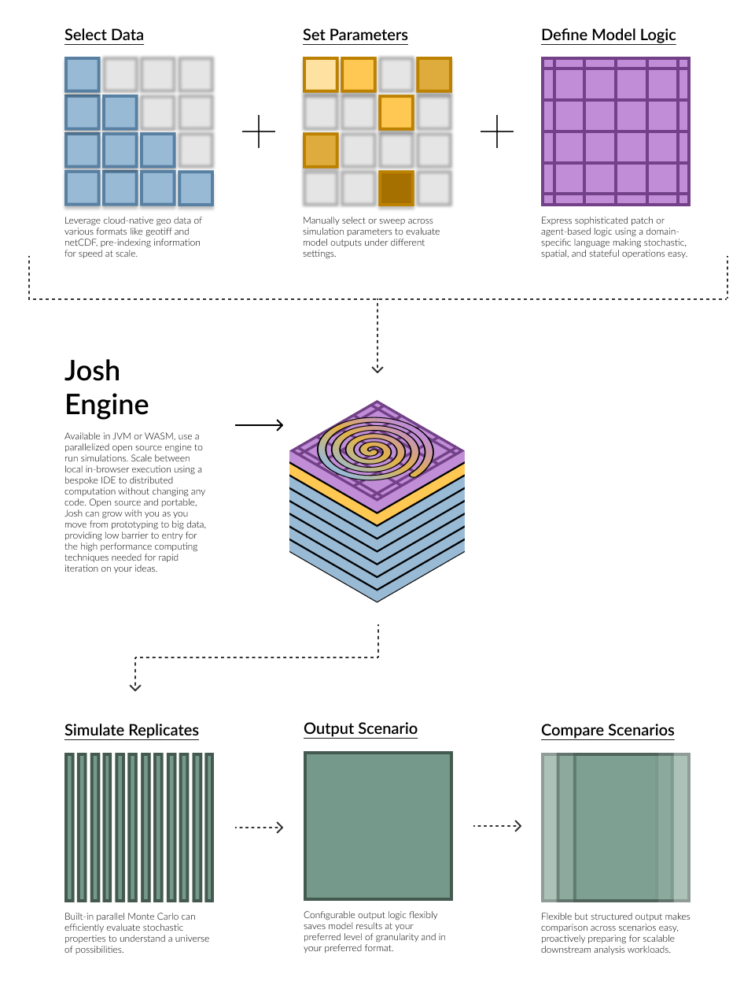

**joshpy** enables parameter sweeps, experiment tracking, and result analysis
for [Josh](https://joshsim.org) agent-based ecological simulations.

## Features

- **Orchestration**: Define parameter sweeps with Jinja templating and execute simulations
- **Tracking**: DuckDB-backed registry for experiment management  
- **Analysis**: Query results across parameter values and replicates
- **Visualization**: Quick matplotlib diagnostics + R/ggplot2 for publication-quality figures

## Get Started

- [Installation](getting-started/installation.qmd) - Install joshpy
- [Quickstart](getting-started/quickstart.qmd) - Run your first sweep
- [Tutorials](tutorials/index.qmd) - Step-by-step guides

## Links

- [Josh Language Documentation](https://joshsim.org)
- [Josh GitHub Repository](https://github.com/SchmidtDSE/josh)
- [joshpy GitHub Repository](https://github.com/SchmidtDSE/joshpy)
